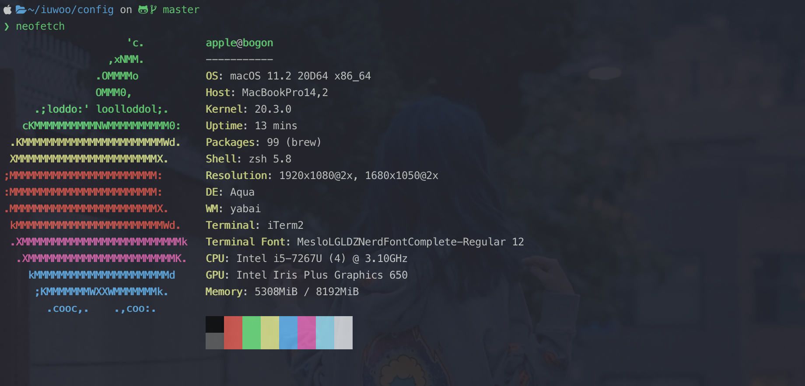

# My Config

记录一下使用中的提高生产力的工具「🔧」

## 系统参数

### macOS Big Sur

the version is **v11.2**

### terminal

my terminal is 「iTerm2 v3.4.4」

### shell

my shell is `zsh`, and strengthen it by `oh my zsh`

选择使用`zsh`代替`bash`的主要原因是 `oh my zsh`良好的生态环境, 借助于`oh my zsh`可以很方便的使用一些有趣的功能(仅仅通过一些配置)

「shell 命令补全」「语法高亮」「主题美化」...

### window manager

#### yabai

my `WM` is 「yabai」

开始成为一名**vimer**后, 我就很不习惯「macOS」的**手势移动**。因为我会花费更多的时间在「移动手指到触摸板」「手势移动」「等待动画过渡」「移动手指到键盘」

在其他环境下, 比如「休闲」 这很**cool**, 但是在**coding**, it is boring

所以我开始寻找一个在`macOS`下的`i3wm`(平铺式窗口管理器), 就是他了 `yabai`

`yabai`通过注入逻辑到`macOS`自身使用的`Dock.app`中, 这样它就能帮助我们创建不同的**space 分区**

它能帮助我们做到下面有趣的事情

-	自动调整`App`大小已实现平铺式的window manager, 而不是`macOS`自身的覆盖式

	如果仅想实现这一点的话, 你完全不必使用`yabai`, 有很多其他的替代工具`magent`...

-	自动创建桌面**space**

	之前我们创建桌面是通过触发`Mission Control`后, 点击添加button, but now 我们可以通过`yabai command`来轻松**创建/销毁**它

-	将在当前桌面的某些`App` 发送到其他桌面(存在或者不存在)

-	交换`App`的位置

-	将某个`App`设置为充满整个整个**space**

	有个时候你在当前**space**创建了多的**window**, 就像上图一样

	某时, 你可能觉得正在工作的**window**太小, 这个时候`yabai`也可以让你轻松的将其放大到充满整个**space**, 就好像这个**space**内只有它一样

- 其他...

关于`yabai`, 我也才刚刚使用, 但是不得不说它真的**so cool**

**but** 令人遗憾的是, 由于其劫持了`Dock.app`, 所以需要关闭`macOS`的`System Integrity Protection`, 这可能让你的电脑不安全

#### skhd

`yabai`劫持了`Dock.app`, 并且暴露出了一些`command interface`让我们可以轻松管理我们的桌面

**but** 这样我们需要在每个**space**都有一个`terminal`来输入命令, 啊这...

所以`yabai`的作者又开发了`skhd`, 它能够将「快捷键」映射为命令(通过配置)

#### spacebar

`spacebar`是桌面状态栏, 它可以描述出一些系统和**space**信息, 借助于它, 我们可以方便的知道要跳转到那个桌面

`spacebar`之前是`yabai`支持, 但是现在`yabai auchor`已不再`yabai`内维护它了, 由其他人(好人)将其从`yabai`中分离作为`spacebar`单独维护

### peripherals

-	hhkb keybord

- colemak keybord layout

### code editor

- nvim
